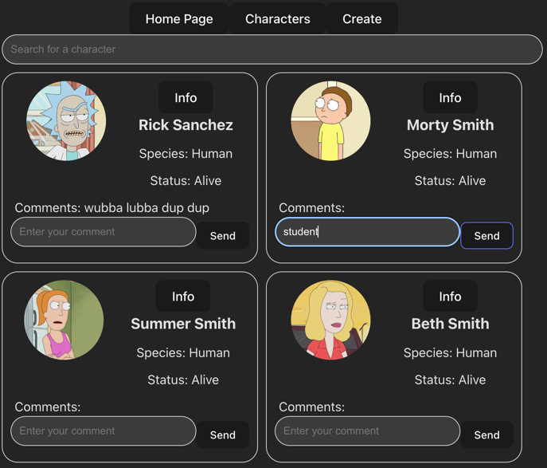

# Rick & Morty Gallery 👽🚀

A small React + TypeScript project powered by React Router and 
the Rick & Morty API.
The app lets you browse characters, view details, and create 
your own characters.

## ✨ Features
-  Search Functionality 🔎 Find your favorite characters by name
-  Character Gallery 🖼  Browse all characters in a responsive card layout
-  Character Detail View 📄 Click on a character to see more information
-  Create New Characters ➕ Add your own characters to the gallery
-  Comment 💬 Leave a comment on a character
-  Navigation Bar 🧭  Jump between Home, Characters, and Create using links or buttons

## 🛠️ Tech Stack
- ⚛️ React
- 🔷 TypeScript
- 🛣 React Router
- ⚡ Vite 

## 🔗 Routes & Examples
- ### 🏠 Home Page 
→ Displays a welcome message
> path = /

- ### 👥 Characters Gallery 

→ Shows all available characters with a search bar
> path = /characters 

- ### 👤 Character Detail Page 
→ Example: Click the Info button to view details about Rick Sanchez
> general path = /characters/:id  
> path to Rick = /characters/1

- ### ➕ Create Page 
→ Add a brand new character to the gallery
> path = /create

## 🚀 Getting Started
1. Clone the repo
   >git clone https://github.com/your-username/rick-and-morty-gallery.git  
   >cd rick-and-morty-gallery
2. Install dependencies
   > npm install
3. Run the project
   >npm run dev  

   The app will be available at 👉 http://localhost:5173

## 🔮 Future Improvements
- 🌍 Fetch live data from the Rick & Morty API instead of local mock data
- 🎨 Improve UI styling with a design system or CSS framework
- 📝 Add error handling & loading states

Built with 💚 and ☕ by Nina